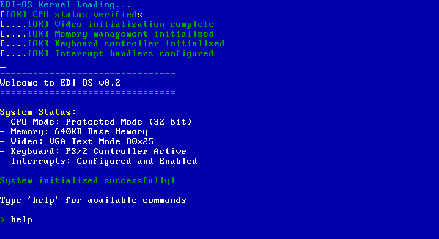

# EDI-OS

EDI-OS is an operating system simplified for educational purposes. This OS covers the minimum requirements of an OS but keeps the source code understandable and easy to comprehend.



## Features

• Custom bootloader
• 32-bit protected mode kernel
• VGA text mode display (80x25)
• Basic keyboard input handling
• Command-line interface
• Color-coded debug/status messages
• Memory management initialization
• PS/2 keyboard controller support
• Basic command set: help, clear, version, about

### Dependencies

• NASM: Netwide Assembler
• GCC with support for 32-bit target
- LD (GNU Linkер)
- QEMU (for emulation)
- Make

For Debian/Ubuntu-based systems:
```bash
sudo apt-get install nasm gcc gcc-multilib qemu-system-x86 make
```

### Running

For running in QEMU :
```bash
make run
```

For debug mode with QEMU monitor:
```bash
make debug
```

## Project Structure

- `boot.asm` - Bootloader with detailed messages
- `kernel.c` - Main kernel with terminal and routines
- `keyboard.c` - Keyboard handling and command processing
- `kernel.h` - Kernel header with type definitions and function declarations
- `linker.ld` - Linker script for kernel building
- `Makefile` - Build automation

## Boot Sequence

1. Initialization of bootloader
2. Check memory
3. Initialization of disk system
4. Loading kernel
5. Switch to protected mode
6. Initialization of kernel
   - Setup video
   - Memory management
   - Setup keyboard controller
   - Setup interrupt handlers

## Available Commands

- `help` - View list of available commands
- `clear` - Clear screen
- `version` - View OS version
- `about` - View information about EDI-OS

## Technical Details

Boots from a virtual floppy disk (1.44MB)
Loads at the 1MB mark
Uses a custom GDT setup
imple I/O port handling
VGA text mode with color support
PS/2 keyboard support with scancode mapping

## Contributing

Contributions are welcome! Feel free to send a Pull Request.
